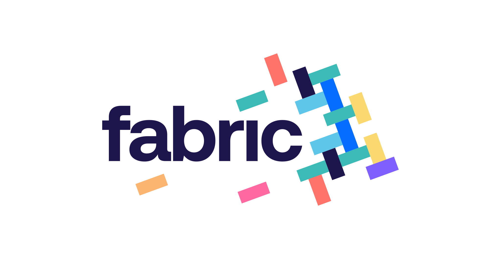

# fabric-cards

This is a monorepo which contains three binaries:

- **Callback** - Contains two APIs
  - [EnrollmentAPI](./docs/callback/api/enrollment/index.md) - The Transaction Controls Client Host Callback API will be
    hosted external to Visa. Card Enrollment callback will be hosted by the authorizing agent.
  - [NotificationAPI](./docs/callback/api/notification/index.md) - Alert notification callback will be hosted by the
    application service responsible for delivering notifications to the consumer.

- **CardControls** - Contains one API
  - [CardControlsAPI](./docs/cardcontrols/api/index.md) - Provide a powerful and convenient way for cardholders to track
    and manage all payment activity on enrolled accounts and tokens

- **Cards** - Contains two APIs
  - [CardAPI](docs/cards/api/cards/index.md) - Provide an interface for Card Management including Get Cards, Card
    Activation, Select PIN & Replacement.
  - [CardEligibilityAPI](./docs/cards/api/eligibility/api/index.md) - Identify the operations that can be performed on a
    given card

## Other Documentation

- [CTM Business Rules](docs/cards/component/integration/ctm.md)
- [User Data](https://confluence.service.anz/display/ABT/Fabric+Platform+Environments)
- [Downstream subscriptions & usage](https://confluence.service.anz/display/EAIS/API+Subscriptions+and+Usage)

## External Dependencies

- [CTM](https://sandpit.developer.dev.anz/eapicorp01/sandpit/api-reference#cards)
- [APIc Visa](https://apiau182devprt01.dev.anz/eapicorp01/sb/node/32513)
- [Visa Transaction Controls](https://developer.visa.com/capabilities/vctc)
- [Entitlements](https://github.com/anzx/fabric-entitlements)

## CI&CD

Build pipelines & tools used for quality control:

- [Harness](https://anz.harness.io/)
- [SonarQube](https://sonarqube.platform-services.services-platdev.x.gcpnp.anz/)
- [BlackDuck](https://blackduck.platform-blackduck.services.x.gcp.anz/)
- [Checkmarx](https://anzx.checkmarx.net/)
- [Splunk](https://anzx.splunkcloud.com/)
- GCP (non production)
  - [apps](https://console.cloud.google.com/home/dashboard?project=anz-x-apps-np-e1bb39)
  - [fabric](https://console.cloud.google.com/home/dashboard?project=anz-x-fabric-np-641432)
  - [fabric-cde](https://console.cloud.google.com/home/dashboard?project=anz-x-fabric-cde-np-ba0f52)
- GCP (production)
  - [apps](https://console.cloud.google.com/home/dashboard?project=anz-x-apps-prod-1e6a27)
  - [fabric](https://console.cloud.google.com/home/dashboard?project=anz-x-fabric-prod-d8873d)
  - [fabric-cde](https://console.cloud.google.com/home/dashboard?project=anz-x-fabric-cde-prod-d3ac9b)

## Observability & Monitoring

[comment]: <> (TODO)

## Guides and Processes

The following guides provide information on contributing to this asset, as well as processes such as deploying to
environments.

- [Getting Started](docs/component/getting-started.md)
- [Code Structure](docs/component/repository-map.md)
- Configuration
  - [Application Config](https://docs.fabric.gcpnp.anz/docs/cd/application-config)
  - [Platform Config](https://docs.fabric.gcpnp.anz/docs/cd/platform-config)
- [Environments](https://docs.fabric.gcpnp.anz/docs/testing/environments/overview)
- [How to Deploy](https://docs.fabric.gcpnp.anz/docs/cd/overview)
- [Monitoring](docs/component/monitoring.md)(Ongoing)
- [Roles & Responsibilities](https://docs.fabric.gcpnp.anz/docs/general/wow/roles-and-responsibilities)
- [Anz Acronyms](http://what/) - Common acronyms used in Anz, which is helpful to understand what other people are
  talking about

### Development

- [GIT Usage](docs/component/git.md)
- [Testing Overview](docs/component/testing-overview.md)(Ongoing)
- [ANZx Tech Principles](https://confluence.service.anz/display/ABT/ANZx+Tech+Principles)
- [ANZx API Standards](https://confluence.service.anz/display/ABT/ANZx+API+Standards+Draft)

## [View Our Team on Backstage](https://backstage.fabric.gcpnp.anz/catalog/default/group/fab-cards)
