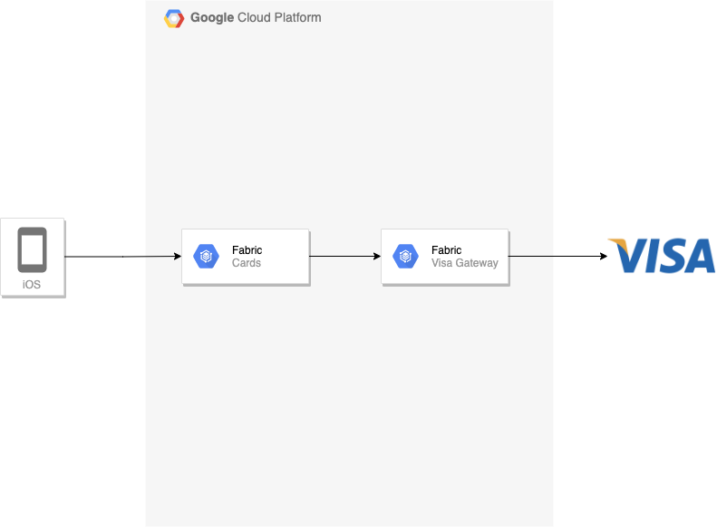

Using a dynamic CVV2 instead of a static CVV2 may significantly reduce the potential for fraud to occur on accounts
following a data compromise. Providing dCVV2 codes to cardholders via a mobile banking app. The Visa dCVV2 Generate
service enables issuers to trial and launch dCVV2 capability with minimal host development costs or risks.

!!! info "Key Features"

    === "Dynamic data"

        Visa dCVV2 Generate offers a simple, fast way to add dynamic data to remote commerce transactions. Because dCVV2 follows the same format as regular CVV2, no merchant or infrastructure changes are required and cardholders are already familar with how it works.

    === "Validated by VisaNet"

        dCVV2 Codes generated by Visa can be validated by Visa during the authorization
        process (using the Visa dCVV2 Authenticate service) meaning that issuers do not need to invest in developing the
        validation capability in house or wait for their processor to offer the capability. Visa also offers the Visa dCVV2
        Convert service, that can replace the dCVV2 code in authorization messages with a static CVV2, so issuers do not need to
        identify and treat transactions with dCVV2 as exceptions.

    === "Fraud Reduction"

        Fraud occuring in the remote or card-absent environment is not generally the financial responsibility of issuer; however, while the cost of the transaction itself may be offset, issuers still incur significant costs associated with fraud investigation, customer service, replacement card production and distribution,  reduced future usage and customer attrition.
        As stolen dCVV2 can be identified and declined by issuers, it can help reduce remote commerce fraud, and cards may not need to be replaced in the event of a data compromise.

## How Does It Work?

Using the Visa dCVV2 Generate API, Issuers may request up to 24 dCVV2 codes for the same account number. dCVV2 codes
generated using the service are time-based and based on the Visa dCVV2 Technical Specification.

Once delivered to the cardholder, the code is used exactly as a static code would be - it's entered into a merchant's
website or provided to a merchant verbally over the phone. The code is then included in the authorization message, and
is validated by Visa. The Visa dCVV2 Convert service replaces the dCVV2 code in authorization messages with a static
CVV2, so issuers do not need to identify and treat transactions with dCVV2 as exceptions.

## Integration

The integration is simple, the app calls into fabric and a dcvv2 code is returned to the app. Currently, this is
performed by
the [GetDetails API](https://backstage.fabric.gcpnp.anz/docs/default/API/fabric.service.card.v1beta1.CardAPI/getdetails)
.

<!---->

The rest of the payment processing flow is as normal, when VisaNet recieves a payment request with a DCVV2 code in it,
it will convert the dynamic value into static before sending the advice through to the switch.

## FAQs

#### How long does a code last for?

a single code is valid for 12 hours, every 12 hours the code changes to its next value.

#### How does b24 know how to validate the dynamic value?

it doesn't, visa will convert the dynamic value into the static value so b24 doesnt need to do anything differently.

## References

- [fabric.service.card.v1beta1.CardAPI/GetDetails](https://backstage.fabric.gcpnp.anz/docs/default/API/fabric.service.card.v1beta1.CardAPI/getdetails)
- [gateway.visa.service.dcvv2.v1.DCVV2API](https://backstage.fabric.gcpnp.anz/catalog/default/api/gateway.visa.service.dcvv2.v1.DCVV2API)
- [external.visa.DCVV2API](https://backstage.fabric.gcpnp.anz/catalog/default/api/external.visa.DCVV2API)
