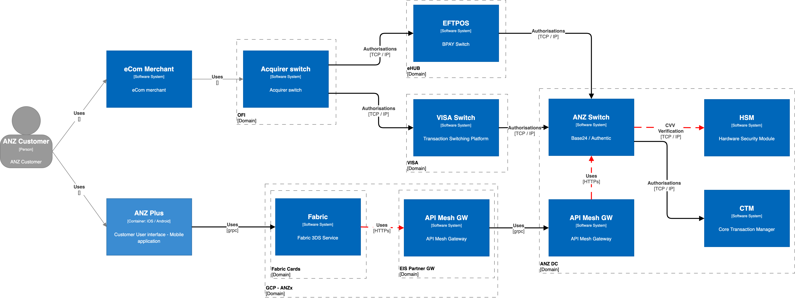

# Context
Initial requirement of displaying the CVV2 in the app to enable customers to perform online purchases without having to look for the physical card was improvised to have dynamic cvv2 displayed in the app instead of the one printed on the back of physical card. This was done to promote better security and the future feature of removing the CVV printed on card, as explained in the architectural decision at DIST-040 Dynamic CVV Generation. The recommended decision was implemented using Visa's apis for a quicker TTM and to test the feature with customers. This feature was well received by many customers but a transaction with a dynamic cvv2 gets completed successfully only if Visa is part of the authorisation. This is due to the fact that the dynamic cvv2 is converted to the static cvv by Visa before the transaction is sent for authorisation to ANZ switch since the switch does not recognise a dynamic cvv2 as the right card verification value. If Visa is not part of the transaction authorisation like the transactions routed through EFTPOS by the online merchant for purpose of Least Cost Routing, then the transaction would be declined by our switch for invalid CVV. With the uptake of this feature and ever growing customer base of ANZ Plus, it is imperative that we build an in-house solution instead of being dependant on Visa.

A dynamic CVV is a time bound card verification value that is valid only for a specific period of time. So, the generation and verification of it needs to consider a specific time window while using the CVV generation algorithm. ANZ switch (Base24 & Authentic) uses Thales PayShield 10K HSM for all types of CVV generation and verification and the product in its latest versions provides support of the dynamic cvv generation and verification. Although this could be leveraged the switch software needs to impement specific logic to stitch the different HSM commands to enable successful transaction authorisation for all online purchases regardless of how it is routed to the switch and what CVV2 the customer uses during purchase.

#Solution Overview

##Behavioural Models

!!! info "Three Phases"

    === "Phase 1 (dCVV2 verify for EFTPOS)"

        ::uml:: format="png" classes="uml myDiagram" alt="My super diagram placeholder" title="My super diagram" width="1500px" height="1500px"
        actor "ANZ Card Holder" as customer
        participant "eCom Merchant" as merchant
        participant "Acquirer" as acquirer
        participant "EFTPOS" as eftpos
        participant "VISA" as visa
        participant "ANZ Channel" as app
        participant "BFF" as bff
        participant "Base 24" as bswitch
        participant "Payshield HSM" as hsm
        participant "CTM" as ctm

        customer -> app : Show me a dynamic CVV
        app -> bff : Get a dynamic CVV
        customer -> app : Show me a dynamic CVV
        app -> bff : Get a dynamic CVV
        bff -> visa : Get dynamic CVV for the card & expiry
        visa --> bff : Dynamic CVV
        bff --> app : Dynamic CVV
        app --> customer : Dynamic CVV
        customer -> merchant : Purchase what i like
        merchant -> acquirer : Authorise transaction
        acquirer -> acquirer : LCR choice
        acquirer -> eftpos : Authorise transaction
        eftpos -> bswitch : Authorise transaction
        bswitch -> hsm : Verify CVV2\n"Command = 'CY'"
        hsm --> bswitch : Verification result
        group#Gold #LightGreen Change Needed
        alt if Failed
        bswitch -> hsm : Verify dynamic CVV2\nCommand = 'PM' with\nScheme ID = 5\nVersion = 0\ncurrent time and TWU
        hsm --> bswitch : Verification result
        alt if Failed
        bswitch -> hsm : Verify dynamic CVV2\nCommand = 'PM'with\nScheme ID = 5\nVersion = 0\ntime minus TWU and TWU"
        hsm --> bswitch : Verfication result
        end
        end
        end
        bswitch -> ctm : Authorise transaction
        ctm --> bswitch : Authorisation result
        bswitch --> eftpos : Authorisation result
        eftpos --> acquirer : Authorisation result
        acquirer --> merchant : Authorisation result
        merchant --> customer : Purchase result
        ::end-uml::

    === "Phase 2 (dCVV2 verify for Visa)"

        ::uml::format="png" classes="uml myDiagram" alt="My super diagram placeholder" title="My super diagram" width="1500px" height="1500px"
        actor "ANZ Card Holder" as customer
        participant "eCom Merchant" as merchant
        participant "Acquirer" as acquirer
        participant "EFTPOS" as eftpos
        participant "VISA" as visa
        participant "ANZ Channel" as app
        participant "BFF" as bff
        participant "Authentic" as aswitch
        participant "Payshield HSM" as hsm
        participant "CTM" as ctm

        customer -> app : Show me a dynamic CVV
        app -> bff : Get a dynamic CVV
        bff -> visa : Get dynamic CVV for the card & expiry & TWU
        visa --> bff : Dynamic CVV
        bff --> app : Dynamic CVV
        app --> customer : Dynamic CVV
        customer -> merchant : Purchase what i like
        merchant -> acquirer : Authorise transaction
        acquirer -> visa : Authorise transaction
        visa -> aswitch : Authorise transaction
        aswitch -> hsm : Verify CVV2\n"Command = 'CY'"
        hsm --> aswitch : Verification result
        group#Gold #LightGreen Change Needed
        alt if Failed
        aswitch -> hsm : Verify dynamic CVV2\nCommand = 'PM' with\nScheme ID = 5\nVersion = 0\ncurrent time and TWU
        hsm --> aswitch : Verification result
        alt if Failed
        aswitch -> hsm : Verify dynamic CVV2\nCommand = 'PM' with\nScheme ID = 5\nVersion = 0\ntime minus TWU and TWU
        hsm --> aswitch : Verfication result
        end
        end
        end
        aswitch -> ctm : Authorise transaction
        ctm --> aswitch : Authorisation result
        aswitch --> visa : Authorisation result
        visa --> acquirer : Authorisation result
        acquirer --> merchant : Authorisation result
        merchant --> customer : Purchase result
        ::end-uml::

    === "Phase 3 (dCVV2 generate locally)"

        ::uml::format="png" classes="uml myDiagram" alt="My super diagram placeholder" title="My super diagram" width="1500px" height="1500px"
        actor "ANZ Card Holder" as customer
        participant "eCom Merchant" as merchant
        participant "Acquirer" as acquirer
        participant "EFTPOS" as eftpos
        participant "VISA" as visa
        participant "ANZ Channel" as app
        participant "BFF" as bff
        participant "API Mesh" as apim
        participant "Authentic" as aswitch
        participant "Payshield HSM" as hsm
        participant "CTM" as ctm

        customer -> app : Show me a dynamic CVV
        app -> bff : Get a dynamic CVV
        group#Gold #LightGreen Change Needed
        bff -> apim : Get a dynamic CVV
        apim -> aswitch : Get dynamic CVV for the card & expiry & TWU
        aswitch -> hsm : Generate a dynamic CVV\n"Command = 'QY'\nScheme ID = 5"
        hsm --> aswitch : Dynamic CVV
        aswitch --> apim : Dynamic CVV
        apim --> bff : Dynamic CVV
        end
        bff --> app : Dynamic CVV
        app --> customer : Dynamic CVV
        customer -> merchant : Purchase what i like
        merchant -> acquirer : Authorise transaction
        acquirer -> acquirer : LCR choice
        alt if EFTPOS
        acquirer -> eftpos : Authorise transaction
        eftpos -> aswitch : Authorise transaction
        end
        alt if Visa
        acquirer -> visa : Authorise transaction
        visa -> aswitch : Authorise transaction
        end
        aswitch -> hsm : Verify CVV2\n"Command = 'CY'"
        hsm --> aswitch : Verification result
        alt if Failed
        aswitch -> hsm : Verify dynamic CVV2\nCommand = 'PM' with\nScheme ID = 5\nVersion = 0\ncurrent time and TWU
        hsm --> aswitch : Verification result
        alt if Failed
        aswitch -> hsm : Verify dynamic CVV2\nCommand = 'PM' with\nScheme ID = 5\nVersion = 0\ntime minus TWU and TWU
        hsm --> aswitch : Verfication result
        end
        end
        aswitch -> ctm : Authorise transaction
        ctm --> aswitch : Authorisation result
        alt if EFTPOS
        aswitch --> eftpos : Authorisation result
        eftpos --> acquirer : Authorisation result
        end
        alt if Visa
        aswitch --> visa : Authorisation result
        visa --> acquirer : Authorisation result
        end
        acquirer --> merchant : Authorisation result
        merchant --> customer : Purchase result
        ::end-uml::
        
