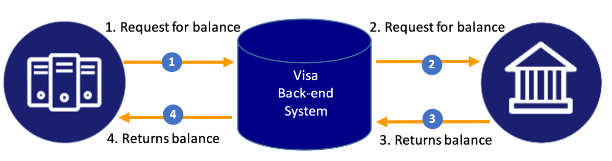
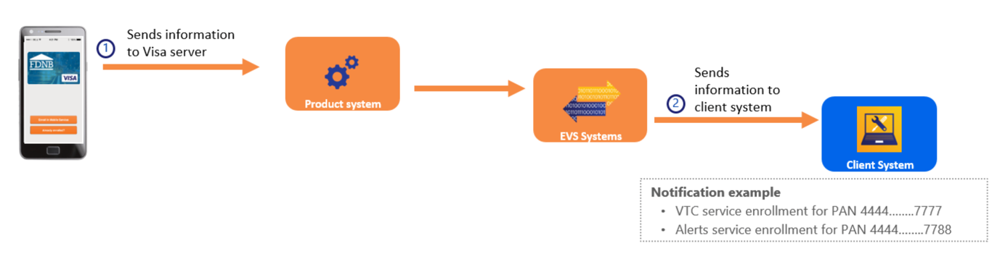

# Overview

Visa Host Callback Application Programmable Interfaces (API) enhance cardholder experience for clients utilizing the
Enhanced Visa Services (EVS) Orchestration platform which expands access and commercializes Visa innovations across
networks, products, channels, and routing options, providing the last mile of connectivity for Issuers and Consumers.
EVS enables VisaNet solutions to provide a consistent connected consumer experience with access to Visa services for
on-us/locally processed transactions. The Host Callback API enables key digital solutions that include, but are not
limited to, the following:

* Visa Digital Commerce Application (VDCA)
* Visa Transaction Controls (VTC)
* Visa Transaction Alerts (VTA)

This document details Host Callback API specifications. Clients call the Host Callback APIs to provide services such as
card balance(s), available credit, and transaction history, which are then available through a client-provided mobile
application or a client-branded VDCA mobile application. For all APIs described in this document, Visa will initiate the
calls to the client system hosting these APIs. The following diagram shows an API flow, using Balance Inquiry as an
example:

Additionally, the Host Callback API provides information to the client through the Service Enrollment Notification
and/or Service De-Enrollment Notification APIs. These APIs inform the client that a cardholder has enrolled in a
service (for example, Visa Transaction Controls), or de-enrolled from a service. Clients need to use this API as a PAN
Whitelist to send mid-stream authorization decisioning requests to EVS. Clients must filter out all Visa processed
network transactions (VisaNet, Interlink, and PLUS) and send non- Visa processed authorization transactions to Visa
through the EVS channels (Composite API or EVS-0100).

### Security and Authentication Requirements

Visa Host Callback APIs use mutual Secure Sockets Layer (SSL) authentication and channel encryption to install a Public
Key Infrastructure (PKI) certificate issued by Visa. Test credentials are separate and distinct for Visa QA environment
and Visa Certification environment. After a project is formally kicked-off, test and production credentials will be
supplied to the client as part of the on-boarding process.

## [View Our Team on Backstage](https://backstage.fabric.gcpnp.anz/catalog/default/group/fab-cards)
