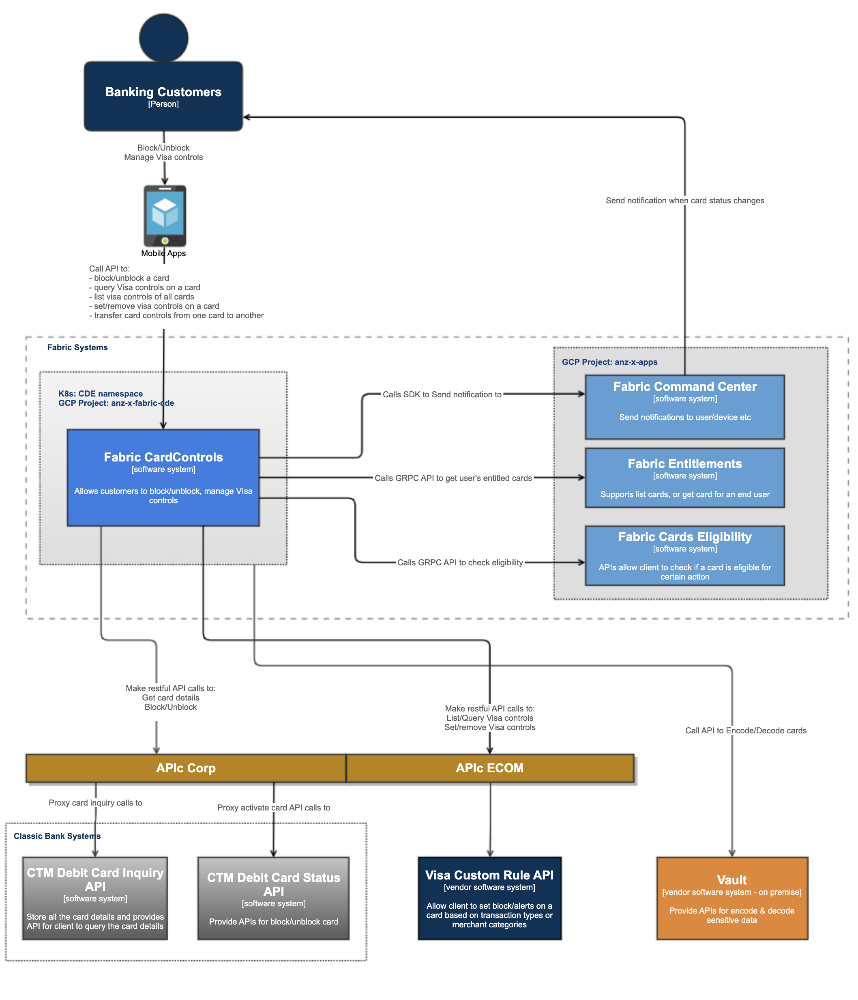

# Overview

Provide a powerful and convenient way for cardholders to track and manage all payment activity on enrolled accounts and
tokens. This service is using Visa Transaction Control to enroll, configure and retrieve an account's card control
settings.

**Service Diagram**

For more diagrams, please check
out  [CardControls Diagrams](https://confluence.service.anz/display/ABT/CardControls+Diagrams)

## Scope

| Feature                 | Description                                                 | Sysl doc                                                                                                 | rpc doc                      |
| ----------------------- | ----------------------------------------------------------- | -------------------------------------------------------------------------------------------------------- | ---------------------------- |
| List                    | List visa controls for all the cards belong to current user | [Link](https://docs.fabric.gcpnp.anz/docs/services/Card-Controls/Card-Controls#cardcontrolsapi-list)     | [rpc: List](./api/list.md) |
| Block                   | Block ALL features and functionality on a given card        | [Link](https://docs.fabric.gcpnp.anz/docs/services/Card-Controls/Card-Controls#cardcontrolsapi-block)    | [rpc: Block](./api/block.md) |
| Query                   | Get all the card controls placed on a card                  | [Link](https://docs.fabric.gcpnp.anz/docs/services/Card-Controls/Card-Controls#cardcontrolsapi-query)    | [rpc: Query](./api/query.md) |
| Set                     | Get all the card controls placed on a card                  | [Link](https://docs.fabric.gcpnp.anz/docs/services/Card-Controls/Card-Controls#cardcontrolsapi-set)      | [rpc: Set](./api/set.md) |
| Remove                  | Set card controls on a card                                 | [Link](https://docs.fabric.gcpnp.anz/docs/services/Card-Controls/Card-Controls#cardcontrolsapi-remove)   | [rpc: Remove](./api/remove.md) |
| Replace                 | Remove a card control on a card                             | [Link](https://docs.fabric.gcpnp.anz/docs/services/Card-Controls/Card-Controls#cardcontrolsapi-replace)  | [rpc: Replace](./api/replace.md) |
| Visa Enrol Callback     | Replace a card number in Visa card controls                 | [Link](https://docs.fabric.gcpnp.anz/docs/services/Card-Controls/Card-Controls#cardcontrolsapi-enrol)    | [rpc: Enrol](./api/enrol.md) |
| Visa Disentrol Callback | Handle the callback from Visa when a card is enrolled       | [Link](https://docs.fabric.gcpnp.anz/docs/services/Card-Controls/Card-Controls#cardcontrolsapi-disenrol) | [rpc: Disenrol](./api/enrol.md) |

## Roadmap

- [Jira Kanban](https://jira.service.anz/secure/RapidBoard.jspa?rapidView=17437&amp;quickFilter=72068)

## Dependencies

> Add dependencies. Use the following format:

| GCP Service      | Description     | Purpose                                            |
| ---------------- | --------------- | -------------------------------------------------- |
| Memstore - Redis | in Memory store | Used for rate limiting & cache vault refresh token |

## Feature / Bug Requests

> For recommended practices to capture the bugs, refer [Bug Management](/book/testing/bug-management.html)

## Release Notes

> Common across Fabric.

[All Release Notes](https://confluence.service.anz/pages/viewpage.action?spaceKey=ABT&amp;title=6.+Digital+Banking%3A+Releases)

## Team

- [View Our Team on Backstage](https://backstage.fabric.gcpnp.anz/catalog/default/group/fab-cards)

