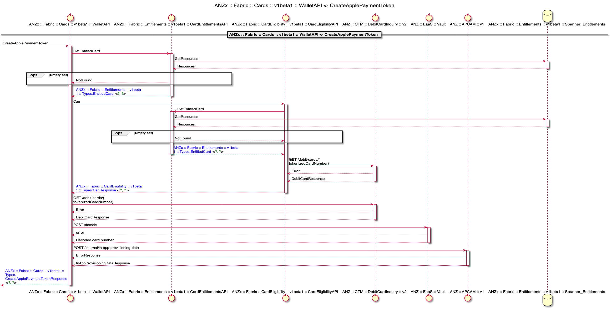

# CreateApplePaymentToken

CreateApplePaymentToken generates the payload, OTP and key that Apple require to put a payment token into the Apple
Wallet for in-app provisioning. This service will prepare the payment data payload for the user, generate an ephemeral
key pair &amp; encrypt the payload with a shared key derived from the Apple public certificates and generated private
ephemeral key. Then it will deliver the encrypted payload and ephemeral public key back to the app. The issuer host will
also generate a cryptographic OTP per the Payment Network Operator (PNO) or service provider specifications and pass
that to the iOS app as well

| Method Name | Request Type | Response Type |
| ----------- | ------------ | ------------- |
| CreateApplePaymentToken | [CreateApplePaymentTokenRequest](#CreateApplePaymentTokenRequest) | [CreateApplePaymentTokenResponse](#CreateApplePaymentTokenResponse) |

### CreateApplePaymentTokenRequest

CreateApplePaymentTokenRequest is the request payload for CreateApplePaymentToken. Apple Wallet requests the public
certificates under which the issuer host should encrypt the payment data payload. The public certificates and nonce are
provided to Apple Wallet. Apple Wallet passes the nonce to the secure element for signing. nonceSignature is returned to
Wallet

| Field | Type | Label | Description |
| ----- | ---- | ----- | ----------- |
| tokenized_card_number | string |  | This is a tokenized string representing an encrypted card fpan |
| nonce | string |  | The rest of these fields are mappings into the apcam REST endpoint A one-time use base64-encoded nonce generated by Apple. |
| nonce_signature | string |  | The base64-encoded device and account specific signature of the nonce. |
| certificates | string | repeated | An array of base64-DER-encoded certificates conforming to the specifications described in Apple’s Issuer Application-Based Provisioning document. The first element is the leaf certificate. The second element is the sub CA certificate. |

```json
{
  "tokenizedCardNumber": "2251855835688382",
  "nonce": "ZWZhZHNmZjIzNDEyMzQxMjQzMTIzcg==",
  "nonceSignature": "WldaaFpITm1aakl6TkRFeU16UXhNalF6TVRJemNnPT0=",
  "certificates": [
    "MIICYDCCAgigAwIBAgIBATAJBgcqhkjOPQQBME0xCzAJBgNVBAYTAkFVMQwwCgYDVQQIDANWSUMxDDAKBgNVBAcMA01FTDEVMBMGA1UECgwMQU5aLCBMaW1pdGVkMQswCQYDVQQDDAJDQTAgFw0xNzA1MzAwMDU4MjBaGA8yMDY3MDUxODAwNTgyMFowTzELMAkGA1UEBhMCQVUxDDAKBgNVBAgMA1ZJQzEMMAoGA1UEBwwDTUVMMRUwEwYDVQQKDAxBTlosIExpbWl0ZWQxDTALBgNVBAMMBExFQUYwWTATBgcqhkjOPQIBBggqhkjOPQMBBwNCAATi9v+FoWFJ7kaW7znWFmKannAyGCL99B5Gnsg+RRSho5054bNX9O3VcXe8/NbVgFGoI/0gGGLFitNCP8OFWFlWo4HVMIHSMB0GA1UdDgQWBBTnMcsNS3qeIABiVs71OoxbqopjYTAfBgNVHSMEGDAWgBSP/I+jB807+ZXcfzac/Kogwft1kjAJBgNVHRMEAjAAMAsGA1UdDwQEAwIFoDBKBgNVHREEQzBBggtleGFtcGxlLmNvbYIPd3d3LmV4YW1wbGUuY29tghBtYWlsLmV4YW1wbGUuY29tgg9mdHAuZXhhbXBsZS5jb20wLAYJYIZIAYb4QgENBB8WHU9wZW5TU0wgR2VuZXJhdGVkIENlcnRpZmljYXRlMAkGByqGSM49BAEDRwAwRAIhAJvuc9LobSfBKan/CzBjAGIuPVhQKb95Q/6twil72gU5Ah9USslVcYrIJDTJoN8h0chdJNuj9hpztSl9JNu+GlbQ, MIICqDCCAk+gAwIBAgIBATAJBgcqhkjOPQQBMIGSMQswCQYDVQQGEwJBVTEMMAoGA1UECAwDVklDMQwwCgYDVQQHDANNRUwxFTATBgNVBAoMDEFOWiwgTGltaXRlZDEMMAoGA1UECwwDQ0FNMSEwHwYDVQQDDBh3d3cucm9vdC1jZXJ0aWZpY2F0ZS5jb20xHzAdBgkqhkiG9w0BCQEWEHRlc3RAZXhhbXBsZS5jb20wIBcNMTcwNTMwMDA1NjQzWhgPMjA2NzA1MTgwMDU2NDNaME0xCzAJBgNVBAYTAkFVMQwwCgYDVQQIDANWSUMxDDAKBgNVBAcMA01FTDEVMBMGA1UECgwMQU5aLCBMaW1pdGVkMQswCQYDVQQDDAJDQTBZMBMGByqGSM49AgEGCCqGSM49AwEHA0IABMbd8c5xiBWoBPjFMxraRov/u2Ex140NCOTUajXizo+VvW2p+VDz3VMSYggZb8afBHCospeopuK4KUN7m4cZILKjgdgwgdUwHQYDVR0OBBYEFI/8j6MHzTv5ldx/Npz8qiDB+3WSMB8GA1UdIwQYMBaAFL1KnPWJHaHxbcXyGZ4VzR1t60QQMAwGA1UdEwQFMAMBAf8wCwYDVR0PBAQDAgKkMEoGA1UdEQRDMEGCC2V4YW1wbGUuY29tgg93d3cuZXhhbXBsZS5jb22CEG1haWwuZXhhbXBsZS5jb22CD2Z0cC5leGFtcGxlLmNvbTAsBglghkgBhvhCAQ0EHxYdT3BlblNTTCBHZW5lcmF0ZWQgQ2VydGlmaWNhdGUwCQYHKoZIzj0EAQNIADBFAiAvEmjURPLZJIog8OzklpuUzJ3pQZpXAraApe0rehEM1gIhAMh1/dDD4e+cmF25wGkYOmdmnHOPT4SCWpvaHVo/nWCg"
  ]
}
```

### CreateApplePaymentTokenResponse

CreateApplePaymentTokenResponse is the encrypted payload and ephemeral public key back to the app. The issuer host will
also generate a cryptographic OTP per the Payment Network Operator (PNO) or service provider specifications and pass
that to the iOS app as well. The app passes the encrypted payment data payload [`encryptedPassData`], the ephemeral
public key assigned to the ephemeral private key used to encrypt the payment data payload [`ephemeralPublicKey`], and
the cryptographic OTP value [`activationData`] to Wallet through the `PKAddPaymentPassRequest` class

| Field | Type | Label | Description |
| ----- | ---- | ----- | ----------- |
| activation_data | string |  | The base64-encoded cryptographic OTP required to activate the card, as described in Apple’s Issuer Application-Based Provisioning document. Every scheme has its own approach to form this value. |
| encrypted_pass_data | string |  | The base64-encoded ciphertext containing the card data, nonce, and nonce signature generated by the Issuer Server, as described in Apple’s Issuer Application-Based Provisioning document. There are three alternatives for the encoding of the encryptedPassData, and the valid options will vary by scheme. Every scheme has its own approach to form this value. |
| ephemeral_public_key | string |  | The base64-encoded ephemeral public key generated for every request, as described in Apple’s Issuer Application-Based Provisioning document. The approach to generate this value is the same for all the schemes. Specifically, this is generated with the algorithm Elliptic Curve 1.2.840.10045.3.1.7, aka prime256v1. |

```json
{
  "activation_data": "string",
  "encrypted_pass_data": "string",
  "ephemeral_public_key": "string"
}
```

## Example

```shell
grpcurl \
-H "env: $ENV" \
-H "service: cards" \
-H "Authorization: Bearer $TOKEN" \
-d "{\"tokenizedCardNumber\": \"$TOKENIZED_CARD_NUMBER\", \"nonce\": \"$NONCE\",\"nonceSignature\": \"$NONCE_SIGNATURE\",\"certificates\": [\"$CERTIFICATE\"]}" \
fabric.gcpnp.anz:443 fabric.service.card.v1beta1.WalletAPI/CreateApplePaymentToken
```


