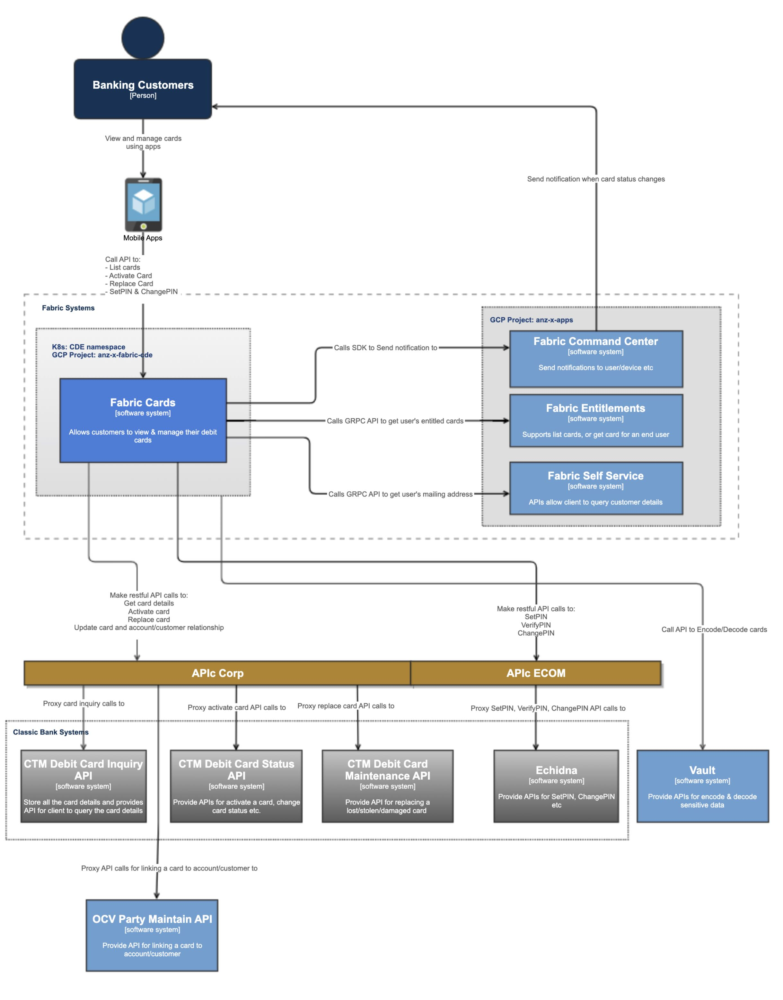

# Overview

CardAPI provides an interface for debit card management functionality. Allowing users to control all aspects of their
physical card lifecycle. From activation, selecting a PIN and replacing t he card, this API will provide end to end self
service.

**Service Diagram**

For more diagrams, please check out  [Cards Diagrams](https://confluence.service.anz/display/ABT/Cards+Diagrams)

## Scope

| Feature    | Description                                                                                                                                          | Sysl doc                                                                            | RPC doc                              |
| ---------- | ---------------------------------------------------------------------------------------------------------------------------------------------------- | ----------------------------------------------------------------------------------- | ------------------------------------ |
| Activate   | Activate activates an inactive card                                                                                                                  | [Link](https://docs.fabric.gcpnp.anz/docs/services/Cards/Cards/#cardapi-activate)   | [rpc: Activate](https://backstage.fabric.gcpnp.anz/docs/default/API/fabric.service.card.v1beta1.CardAPI/activate)     |
| AuditTrail | Allow banker to get detailed info of a card for auditing purpose                                                                                     | [Link](https://docs.fabric.gcpnp.anz/docs/services/Cards/Cards/#cardapi-audittrail) | [rpc: AuditTrail](https://backstage.fabric.gcpnp.anz/docs/default/API/fabric.service.card.v1beta1.CardAPI/audittrail) |
| GetDetails | This API allows client to get card details such as card number in its plain form, cvc(TBD), expireTime etc                                           | [Link](https://docs.fabric.gcpnp.anz/docs/services/Cards/Cards/#cardapi-getdetails) | [rpc: GetDetails](https://backstage.fabric.gcpnp.anz/docs/default/API/fabric.service.card.v1beta1.CardAPI/getdetails) |
| List       | AThis API allows client to list all cards of the current user                                                                                        | [Link](https://docs.fabric.gcpnp.anz/docs/services/Cards/Cards/#cardapi-list)       | [rpc: List](https://backstage.fabric.gcpnp.anz/docs/default/API/fabric.service.card.v1beta1.CardAPI/list)             |
| Replace    | This API allows client to request a replacement card for stolen/damaged card                                                                         | [Link](https://docs.fabric.gcpnp.anz/docs/services/Cards/Cards/#cardapi-replace)    | [rpc: Replace](https://backstage.fabric.gcpnp.anz/docs/default/API/fabric.service.card.v1beta1.CardAPI/replace)       |
| SetPIN     | A client will use this service to set the PIN a card for the first time. If the card provided is not already activated in CTM, it will be activated. | [Link](https://docs.fabric.gcpnp.anz/docs/services/Cards/Cards/#cardapi-setpin)     | [rpc: SetPIN](https://backstage.fabric.gcpnp.anz/docs/default/API/fabric.service.card.v1beta1.CardAPI/setPIN)         |
| VerifyPIN  | To check if a pin is correct                                                                                                                         | [Link](https://docs.fabric.gcpnp.anz/docs/services/Cards/Cards/#cardapi-verifypin)  | [rpc: VerifyPIN](https://backstage.fabric.gcpnp.anz/docs/default/API/fabric.service.card.v1beta1.CardAPI/verifyPIN)   |
| ChangePIN  | Change an existing PIN set on a card. The old pin needs to be provided.                                                                              | [Link](https://docs.fabric.gcpnp.anz/docs/services/Cards/Cards/#cardapi-changepin)  | [rpc: ChangePIN](https://backstage.fabric.gcpnp.anz/docs/default/API/fabric.service.card.v1beta1.CardAPI/changePIN)   |
| ResetPIN   | Change an existing PIN set on a card without providing the old pin. But an step up authentication(bio authentication) is required.                   | [Link](https://docs.fabric.gcpnp.anz/docs/services/Cards/Cards/#cardapi-resetpin)   | [rpc: ChangePIN](https://backstage.fabric.gcpnp.anz/docs/default/API/fabric.service.card.v1beta1.CardAPI/resetPIN)    |

## Roadmap

- [Jira Kanban](https://jira.service.anz/secure/RapidBoard.jspa?rapidView=17437&amp;quickFilter=72068)

## Dependencies

> Add dependencies. Use the following format:

| GCP Service      | Description     | Purpose                                            |
| ---------------- | --------------- | -------------------------------------------------- |
| Memstore - Redis | in Memory store | Used for rate limiting & cache vault refresh token |

## Feature / Bug Requests

> For recommended practices to capture the bugs, refer [Bug Management](/book/testing/bug-management.html)

## Release Notes

> Common across Fabric.

[All Release Notes](https://confluence.service.anz/pages/viewpage.action?spaceKey=ABT&amp;title=6.+Digital+Banking%3A+Releases)

## Team

- [View Our Team on Backstage](https://backstage.fabric.gcpnp.anz/catalog/default/group/fab-cards)

