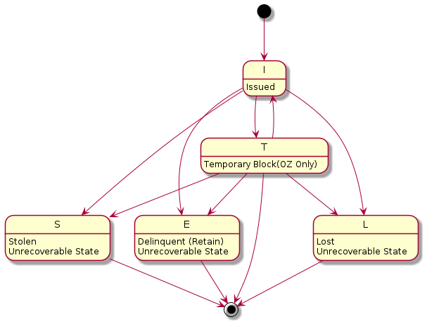

# CTM

## Get Details

Use this Debit Card Inquiry API to retrieve Card details using the CTM Card Inquiry service. For a given debit card
number, information such as status, product codes, customer linkage, daily limits of the FSO and ATM transactions,
history, etc. will be fetched for the consumer. This API interacts with of the CTM message PCTM-PCM-CARD-ENQ v08.

## Update details

This operation is used to only update (maintain) the personal details surrounding a card in CTM. These details can only
be updated if the card is in Issued status. Personal details on the card cannot be edited once a card status is set to
Lost or Stolen status. To update preferences, or to request a replacement card, refer to the other operations in this
API.

## Replace

**Replace a debit card with new or old card details**

1. Ordering a replacement card with old details, i.e. same PAN as the current card, can only be done if the card is in a
   Issued status. In this case, the plasticType should be set to Same Number, and you are able to update any of the
   other details on the card before it is despatched. A possible use-case for this is if a card is physically damaged,
   and a customer would like to request a replacement.
2. Ordering a replacement card with new details, i.e. different PAN from the current card, can only be done if a card is
   in a Lost or Stolen status. In this case, the plasticType should be set to New Number, and you are not able to update
   any other details on the card before it is despatched. The only use-case for this is when a card has either been
   Lost, Stolen, or the card details compromised, allowing a customer to have a replacement card with new details sent.

## CTM CardStatus & CardStatusReason state change rules

The business logic defined in CTM is a bit difficult. This page attempts to record the rules and make sense of it.

### CardStatus

- CardStatus defines the current state of a given card. A CardStatus can change over the cards lifecycle
- The CardStatus can be changed as a result of a falcon event, these events are not controlled by us and should not be
  attempted
- Other CardStatus values are only used for credit cards. At the time of writing this, ANZx only has debit cards in
  scope
- Some CardStatus cannot be recovered from a state once it has entered

The table below maps CardStatus to a human readable description. Also defined is the CardStatus that can become the
active status from the originating state paired with the valid reason combinations that can be given when attempting to
update CardStatus.

| CardStatus        | Description                  | Valid Status Change        | Valid Reason Combination
|-------------------|------------------------------|----------------------------|---------------------------------------------------------------------------------------------------------------------------------------------------------------------------------------------
| C                 | Closed                       | Credit only                | -
| D                 | Delinquent (Return)          | Credit only                | -
| E                 | Delinquent (Retain)          | Unrecoverable state        | A, B, C, D, F  (E/D is when customer received a damaged new card and refused to have another card with the same number. So the damaged card is set to E/D and a new card number is ordered)
| I                 | Issued                       | E, L, S, T                 | blank
| L                 | Lost                         | Unrecoverable state        | A, B
| S                 | Stolen                       | Unrecoverable state        | A, B
| U                 | Unissued (N&D ICI Cards)     |                            | -
| T                 | Temporary (OZ Only)          | E, L, S, I                 | blank
| A                 | Block ATM                    | Falcon only                | -
| B                 | Block ATM & POS (Exclude CNP | Falcon only                | -
| F                 | Block ATM, POS, CNP & BCH    | Falcon only                | -
| G                 | Block ATM, POS & CNP         | Falcon only                | -
| H                 | Block CNP                    | Falcon only                | -
| P                 | Block POS (exclude CNP       | Falcon only                | -

Defined below is a map between CardStatusReason and their human readable description.

| CardStatusReason  | Description                       |
|-------------------|-----------------------------------|
| A                 | With PIN or Account Related       |
| B                 | Without PIN                       |
| D                 | Damaged                           |
| L                 | Last Prime debit linkage deleted  |
| C                 | Closed(OZ only)                   |
| F                 | Fraud (OZ only)                   |

The Diagram below show the state machine of the debit card status

